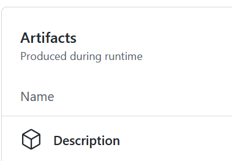

# README: Graph Track Submission

## ToDo before Submission

  1. Develop your instances and their example outputs
     - Examples are given in [graph](/graph/). Please replace those files with your submission.
     - (Check) your instances are written in [ISR format](https://core-challenge.github.io/2023/format/#input-file-format)?
     - (Check) your instance outputs are written in [the output format](https://core-challenge.github.io/2023/format/#output-file-format)?
  2. Clone this repository [2023graph-submission](https://github.com/core-challenge/2023graph-submission) and edit it as your private repository. This repository contains a GitHub Actions and checks your files are fine or not everytime you push.
  4. Write your instance description as [main.tex](/description/main.tex). 
  5. The final state of your Github private repository is:
     - `description/main.tex` can be compiled using `latexmk` (You can check the compiled PDF via the `Description` in the `Artifacts` as shown below).

       
